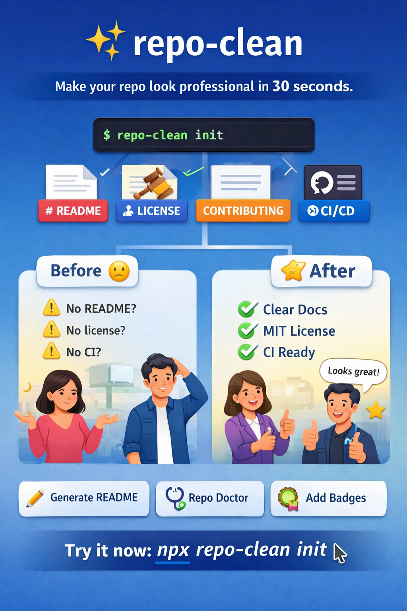

# repo-clean ✨

> Make your repo look professional in **30 seconds**.



## What it does

`repo-clean` is a tiny CLI that:
- **Generates** essential open-source files (README / LICENSE / CONTRIBUTING / CODE_OF_CONDUCT / SECURITY)
- **Checks** repo “health” with a `doctor` command (what’s missing, what to add)
- Works with a safe default: **won’t overwrite** existing files unless you ask it to

## Install

```bash
npm i -g repo-clean
# or
npx repo-clean doctor
```

## Quick start

```bash
repo-clean init
repo-clean doctor
repo-clean add license mit
```

## Commands

```bash
repo-clean init               # generate essential repo files (safe, no overwrite)
repo-clean doctor             # check common repo health items
repo-clean add license mit    # add MIT license if missing
repo-clean --help             # show help
```

## Examples

### Initialize a fresh repo

```bash
mkdir my-lib && cd my-lib
git init
repo-clean init
```

### Health check an existing repo

```bash
repo-clean doctor
```

## Contributing

See [CONTRIBUTING.md](CONTRIBUTING.md).

## License

MIT — see [LICENSE](LICENSE).
